# 前置准备

## 准备一根USB-A转type-c的数据线，一般的具有数据传输功能的手机充电线即可（如果你是MacOS，准备两头为type-c的数据线）

## 从大电视下方的纸箱里拿一个充电器，连接香橙派的DC电源接口为香橙派充电

>注意：香橙派上注明了各个接口的名字，DC接口在最左侧，不要连接type-c/UART接口！  

## 安装MobaXterm应用

>注意：如果你是Macbook，则不需要安装Mobaxterm  

MobaXterm 是一款适用于 Windows 的多功能一体化终端软件，它将 SSH 客户端、X11 服务器及其他多种远程网络工具集成在了一起，让你能在一个地方，用最简单的方式远程连接和管理其他电脑  

1. MobaXterm的官网网址是`https://mobaxterm.mobatek.net/` 

2. 进入MobaXterm的下载网页后点击`GET MOBAXTERM NOW!`  
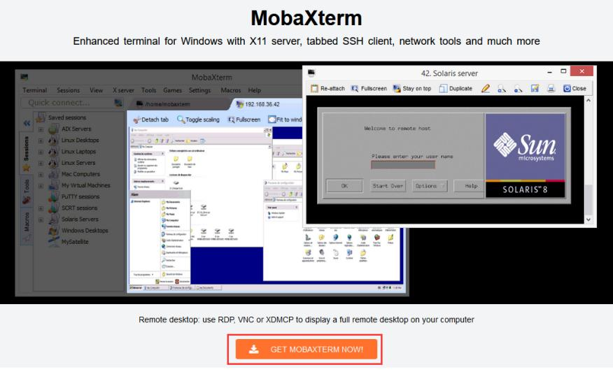  

3. 选择下载Home版本 
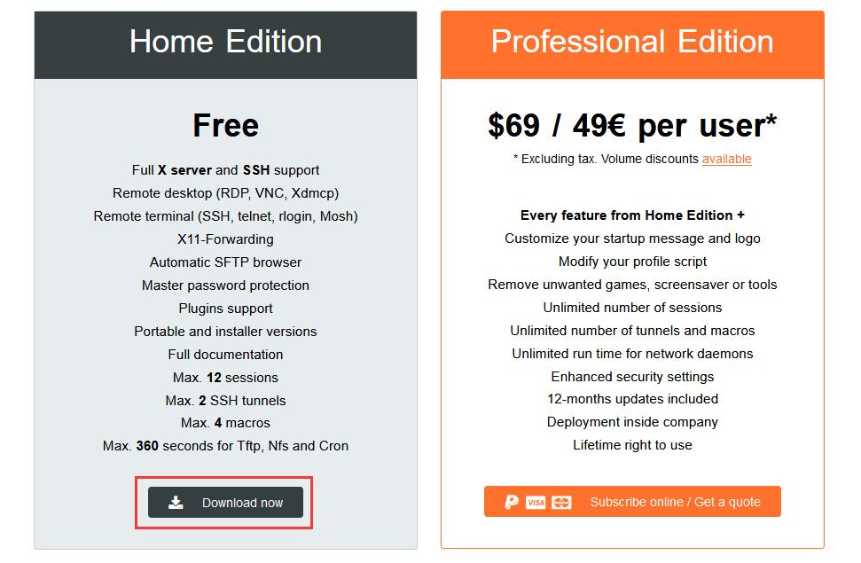  

4. 选择Portable便携式版本，下载完后无需安装，直接打开就可以使用
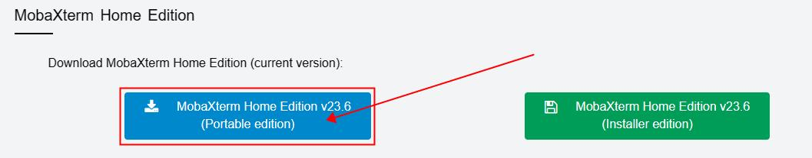  

5. 下载到本地后解压下载的压缩包，即可得到MobaXterm的可执行软件，双击打开即可使用
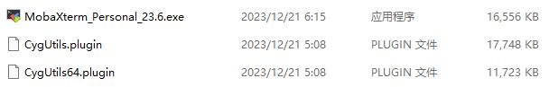

## 了解香橙派
​       你可以将香橙派（Orange Pi）理解为一台功能齐全但体积极小的电脑。它能够运行像Linux这样完整的操作系统，就像你的笔记本电脑运行Windows或macOS一样。与我们熟悉的电脑最大的不同是，它本身没有配备屏幕、键盘和鼠标这些直接与我们交互的设备。  

​       因此，我们接下来所有操作的核心目的，就是通过数据线或网络，把我们自己的电脑作为香橙派的“临时”屏幕和键盘。这样，我们就能在自己的电脑上向香橙派下达指令，并实时看到它返回的结果，从而实现对它的完整控制。

​       为什么我们要使用香橙派？

​       香橙派，就是智能小车的“大脑”（之一），它足够强大，它的计算能力足以处理来自摄像头的高清图像，并实时运行复杂的智能算法来做出决策；它足够小巧，它可以轻松地安装在小车上，不会影响小车的灵活性；它接口丰富，它有专门的接口用来连接摄像头、传感器和控制马达的电路。

​        下面，我们将进入正式的操作。

# 串口调试
>注意：这一部分分为Windows版和MacOS版，请根据你的电脑参考对应部分的文档，MacOS版的操作流程源自AI
## 通过MobaXterm调试串口（Windows）
0. 用USB-A转type-c的数据线连接电脑（USB-A）和香橙派（UART接口）  

1. 双击打开MobaXterm应用程序，点击左上角的`Session`，在弹出窗口选择`Serial` 

2. 在`Serial port`的下拉菜单中选择串口的端口号（根据实际情况选择，一般是COM开头），设置`Speed`为`115200`  

3. 点击`OK`按钮完成设置，即可看到登陆引导（可能需要在对应的标签页再按一次回车键）  
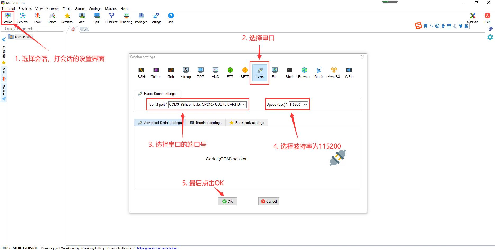  
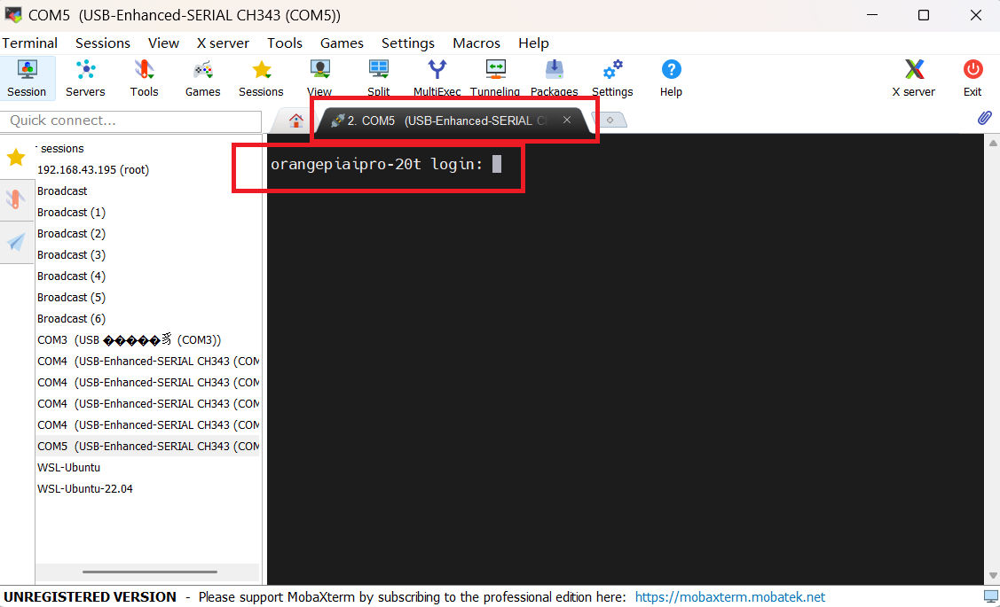
>注意：如果一直没有看到启动日志和登陆引导，且【所有设置、连接准确无误】，那么有可能是你的线可能只是充电线而不是数据线/密码被人修改/香橙派烧录的Ubuntu镜像损坏 ……请向志愿者寻求帮助

4. 当登陆引导出现时，使用下面的账号和密码登陆香橙派 
>注意：在MobaXterm的香橙派终端输入以下命令 
```bash
# username
root
# password
Mind@123
```
>注意：在输入密码时不会回显你已经输入的字符，所以正常输入即可，没有显示不是因为系统卡住等错误发生  

连接成功后，显示类似如下的输出
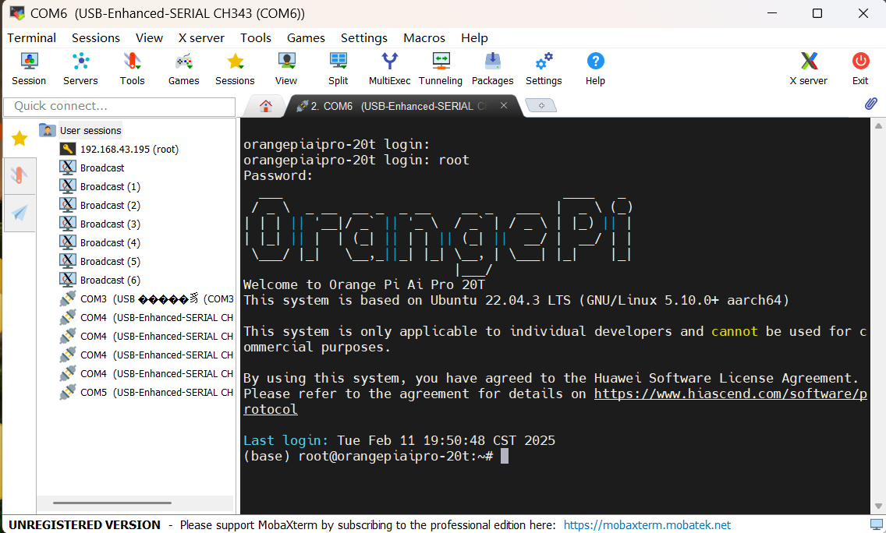

## 通过MacOS终端进行串口调试

1. 用两头为type-c的数据线连接电脑（type-c）和香橙派（UART接口）

2. 查找串口设备号
（使用聚焦搜索找到`终端`）打开`终端`应用，输入以下命令查看所有串口设备
```bash
ls /dev/tty.*
```
在列表中找到你的香橙派对应的设备，请记录或复制下这个完整的设备名称
>注意：当没有连接香橙派时，输入这个命令后显示的大致如图，而香橙派设备的名称与如图的名字相差应该很大，大致形如/dev/tty.wchusbserialXXXX
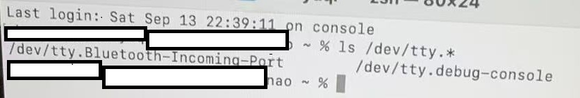

3. 连接到串口
```bash
sudo screen <你的串口设备号> 115200 # 用你上一部复制的名称进行替代，注意<>不需要输入
```
执行命令后，可能会要求输入你的 Mac 电脑的登录密码（输入时不可见）  
按下回车键，即可看到香橙派的登录引导信息，与MobaXterm中看到的界面是一样的

4. 登陆香橙派

```bash
# username
root
# password
Mind@123
```
>注意：在输入密码时不会回显你已经输入的字符，所以正常输入即可，没有显示不是因为系统卡住等错误发生  

# 配置香橙派连接校园网


依次输入以下命令，利用nmcli添加802.1x认证Wi-Fi连接校园网 
>注意：以下命令在MobaXterm上的香橙派终端/Mac刚刚打开的终端（命令提示符应该为香橙派而不是你的电脑名字）输入

>提示：你可以直接从这里复制命令，然后在终端中右键粘贴

>提示：在终端，点击键盘右下方的`▲`键即可显示你输入的上一条命令

1. 清理旧的配置  

由于你的香橙派可能被很多人使用过，我们必须先删除可能存在的旧配置
```bash
# 显示所有已存在配置
sudo nmcli con show
```
如果在列出的清单中看到`Tsinghua-Secure`这一行，说明存在旧配置，你需要执行以下命令删除旧配置；如果没有，直接进入下一步操作
```bash
# 删除名为Tsinghua-Secure的旧网络配置
sudo nmcli con delete Tsinghua-Secure
```

2. 创建并配置新的Wi-Fi连接  

```bash
# 扫描可用的Wi-Fi信号
sudo nmcli d wifi
```
执行后，正常情况下，在显示的列表中你能看到`Tsinghua-Secure`，按`q`退出查看模式，重新出现命令提示符
```bash
# 创建连接配置文件框架
sudo nmcli con add type wifi ifname wlan0 con-name Tsinghua-Secure ssid Tsinghua-Secure
```
```bash
# 进入交互模式
sudo nmcli con edit Tsinghua-Secure
```
执行这条命令后，终端提示符将变为`nmcli>`，请**逐一**输入以下`set`命令（nmcli>是终端提示符，不用输入，从`set`开始输入）  

>注意：`set`命令的输入顺序并不影响结果，但是一条都不能少，一条都不能错；如果输错了其中一条，重新输入正确的覆盖即可
```bash
# 设置EAP和内部认证方法
nmcli> set 802-1x.eap peap
nmcli> set 802-1x.phase2-auth mschapv2

# 设置你的校园网用户名（将<your_name>替换为你的学号或邮箱前缀，<>本身不用输入）
nmcli> set 802-1x.identity <your_name>

# 设置你的校园网密码（将<your_password>替换为你的真实密码，<>本身不用输入）
nmcli> set 802-1x.password <your_password>

# 设置密钥管理方式为WPA-EAP
nmcli> set wifi-sec.key-mgmt wpa-eap

# （可选）设置为开机自动连接
nmcli> set connection.autoconnect true
```
>注意：如果设置了自动连接，下次开机后会自动连接校园网，可以在[校园网自助服务平台-首页-在线信息](https://usereg.tsinghua.edu.cn/home)处查看设备的ip地址  

3. 保存配置并激活连接   

保存并激活
```bash
nmcli> save
nmcli> activate
nmcli> quit # 退出nmcli交互模式
```
如果在`activate`命令后如图所示，那么已正确连接（如果前面的操作全部正确，那么activate之后就会成功）如果连接失败，请再次检查你是否输入了正确的用户名、密码、set命令
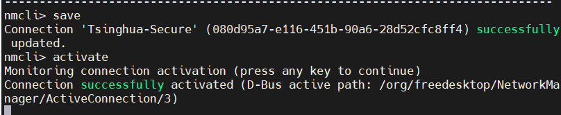
>注意：如果你在执行`quit`前没有`save`，那么你之前所有通过`set`命令配置的信息都将丢失，你需要从`sudo nmcli con edit Tsinghua-Secure`开始重新依次输入  

>注意：如果你在执行`quit`前执行了`save`、但是没有`activate`，你只需要在执行`quit`返回到普通终端后输入以下命令手动激活连接即可`sudo nmcli con up Tsinghua-Secure` 

4. 确认连接并获取香橙派IP地址  

```bash
ifconfig
```
输入这行命令后，系统会回复一长串不同种类的地址，在其中找到`wlan0`网卡`inet`地址`xxx.xxx.xxx.xxx`，请复制或记下这个IP地址，图中是183.173.137.37  
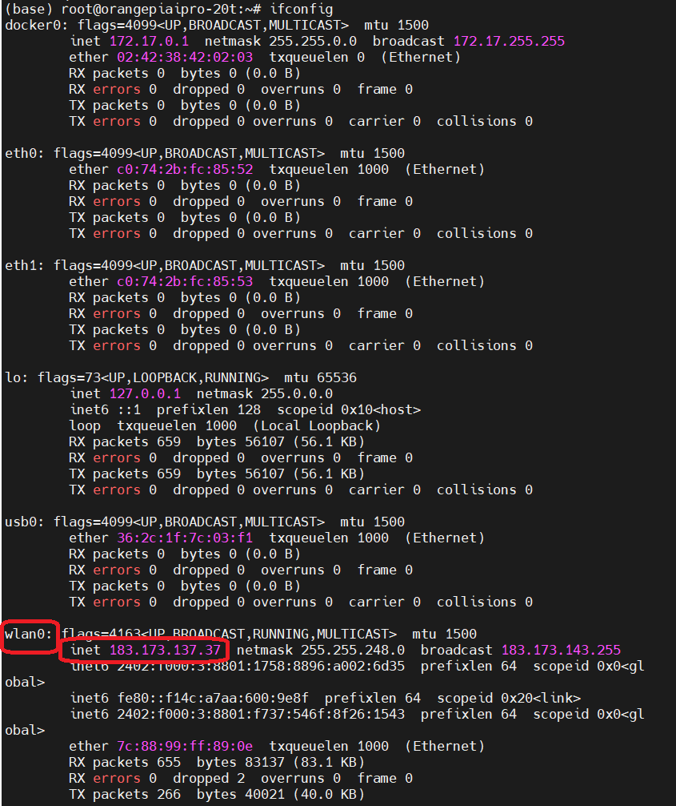

# 建立SSH远程连接

   当你通过网络（比如校园网、互联网）连接到另一台电脑时，你输入的命令和密码都是在网络上传输的。如果没有加密，就像在大街上喊话一样，任何人都能偷听到。ssh 是一种网络加密协议，它通过加密所有通信流量，来保障在不安全网络上进行远程登录、文件传输和命令执行的安全性。  

   日常生活中常见的https也是一种网络协议，ssh和https是两种完全独立、目标不同的网络协议。它们像是两条并行的公路，都跑在互联网这个大地上，但一条（HTTP）是用来运输“网页”这种货物的，而另一条（SSH）是用来建立一条“远程管理”的秘密通道的。  

## 检查电脑OpenSSH客户端已启用  
>注意：如果你是Macbook，则不需要检查，直接进入下一步

1. 回到桌面，鼠标右键，在右键菜单中选中`在终端中打开`打开终端  
>提示：还有其他方式打开终端，比如快捷键`win+R`在出现的菜单中选择`终端`等等  

2. 检查OpenSSH客户端是否启用
>注意：在本地终端输入如下命令  
```powershell
ssh -V # 注意V是大写，会输出OpenSSH版本，例如 OpenSSH_for_Windows_8.1p1
```
- 如果显示类似上图输出OpenSSH客户端已启用，可以跳过后续步骤  
- 如果提示`ssh不是内部或外部命令`，说明还没有启用或安装，打开`设置->系统->可选功能->查看和编辑可选功能`，在搜索框里输入`OpenSSH`并安装/添加该功能，然后再执行这条命令    

- 如果仍然没有成功，后续在需要使用本地终端建立ssh连接时，可以暂时在MobaXterm的SSH session中进行操作 
>提示：Windows10/11默认已经自带OpenSSH，但有时候需要手动启用

## 建立ssh远程连接
1. 检查香橙派是否正常运行ssh服务

>注意：以下命令在MobaXterm的香橙派终端输入  
```bash
# 检查香橙派是否安装和运行ssh服务
sudo systemctl status ssh
```
- 如果显示`active/running`，说明正在运行，按`q`退出查看模式，可以直接进入下一个步骤  
  
- 如果显示`inactive`，输入以下命令，然后再执行上面的命令进行检查
```bash
# 启动ssh并设置开机自启
sudo systemctl enable --now ssh
```
- 如果显示`not found`，输入以下命令，然后再执行上面的命令进行检查
```bash
sudo apt update
sudo apt install openssh-server # 这里可能需要输入香橙派密码并手动输入yes进行确认
sudo systemctl enable --now ssh
```

2. 建立ssh远程连接  

>注意：以下命令在本地终端输入
```powershell
# <>替换为上一步获得的IP地址，不用输入<> 
ssh root@<xxx.xxx.xxx.xxx>
```

如一切正常，需要你手动输入`yes`进行确认，然后根据提示输入密码，密码为`Mind@123`，在输入时依然不会回显
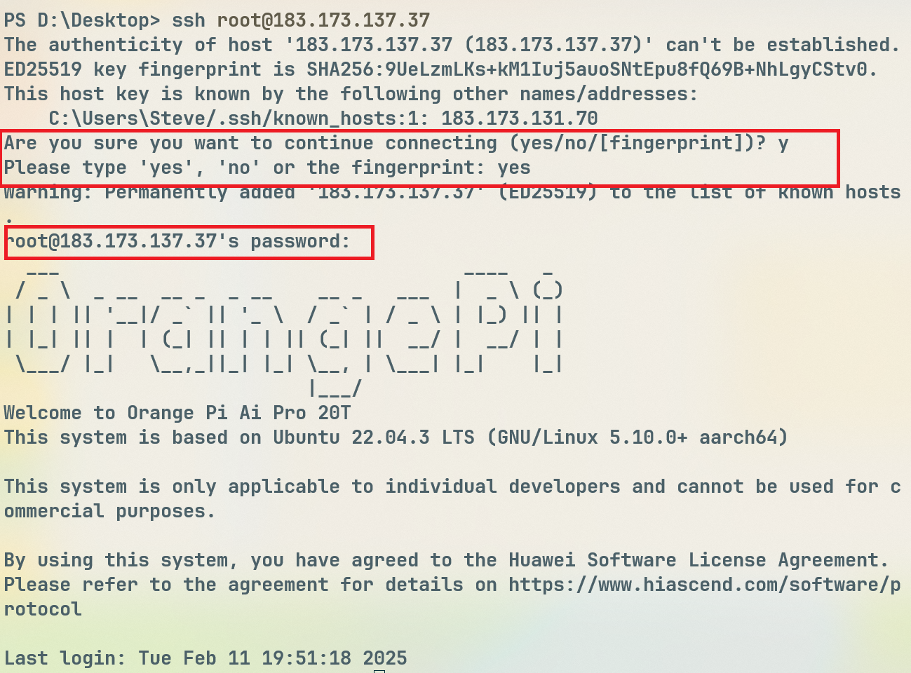  
**在建立ssh连接后，就可以拔掉电脑与香橙派之间的数据线了**  
>注意：如果你的电脑本地终端无法使用ssh命令，那么请点击MobaXterm的`session`，在弹出窗口点击`ssh`,然后输入`xxx.xxx.xxx.xxx`进行连接

2. *在vscode中借助插件建立远程连接*
    虽然我们已经能通过终端远程控制香橙派，但对于编写和管理代码来说，使用VS Code这样带有图形化界面的工具会方便得多。
    不过，VS Code的远程连接对网络质量更敏感，偶尔可能会中断。因此，我们首先确保你能通过本地终端成功SSH连接到香橙派，然后再尝试在VS Code中建立连接

- 打开vscode，在插件市场搜索`Remote-SSH`并安装，注意它的开发者是`Microsoft`，插件标识符为`ms-vscode-remote.remote-ssh`  （在页面右侧查看开发者和插件标识符）

- 通过快捷键`Ctrl`+`Shift`+`P`打开vscode上方的命令面板，输入`add new ssh host`，点击弹出的命令提示，然后根据要求输入`ssh root@<xxx.xxx.xxx.xxx>`和密码`Mind@123`，选择系统为`Linux`，根据vscode的系统提示操作，即可通过vscode建立ssh连接，在vscode的终端执行命令  

- 如果左下角显示为香橙派的IP地址，即表示连接成功建立
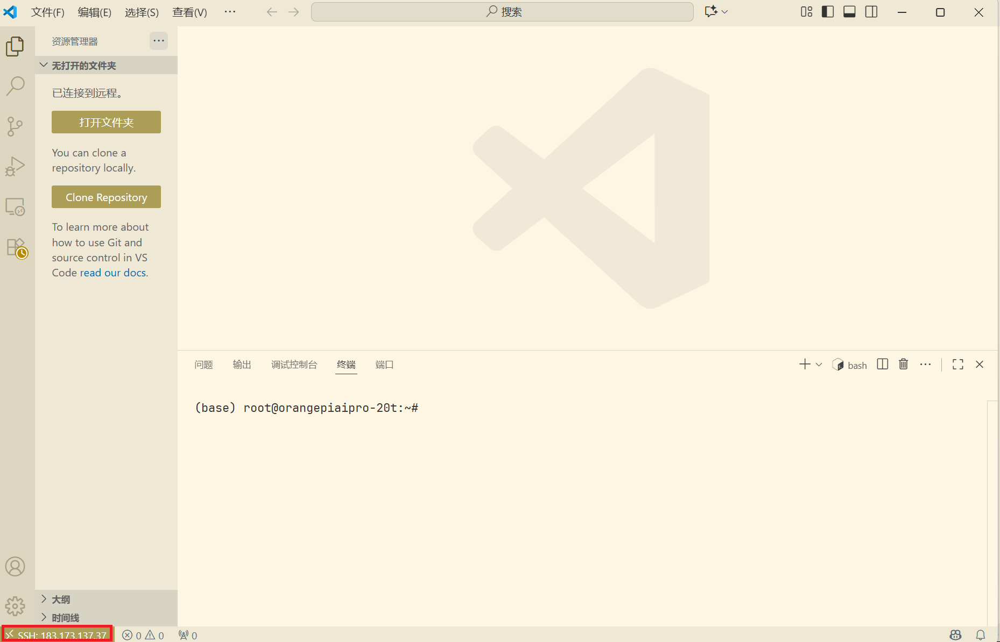


# *通过HDMI显示Linux桌面*

>注意：中央主楼520可能并没有足够多的两头均为HDMI的线来完成本部分操作

  在前面的部分，我们都是将自己的电脑作为香橙派的“远程”键盘和屏幕。现在，我们将反过来，为香橙派接上它“自己”的显示器、键盘和鼠标，来直接看到它原生的“电脑桌面”。
  这种方式能让你直观地体验香橙派的图形界面。当然，它并不是唯一的方法，在之后的培训中，我们还会学习如何通过X11转发/TightVNC，在自己电脑上远程“看到”并操作香橙派的桌面。  

1. 建立HDMI连接

你面前的显示屏和下面的主机间由一根两头都为HDMI接口的线连接，拔下与主机连接的一头，接入香橙派的HAMI0口  
>注意： 香橙派有两个HDMI2.0接口，目前只有HDMI0支持显示Linux系统桌面，因此必须连接HDMI0口！  

2. 接入鼠标和键盘

你面前的鼠标和键盘均与主机通过USB-A接口连接，拔下与主机连接的一头，接入香橙派的两个USB-A口

3. 登陆

开发板上电开机后，需要等待一段时间，HDMI 显示器才会显示Linux 系统的登录界面，登录界面如下图所示
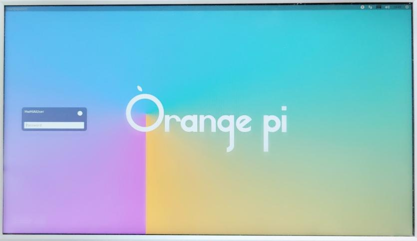
Linux 桌面系统的默认登录用户为`HwHiAiUser`，登录密码为`Mind@123`。目前没有打开root 用户登录的通道。成功登录后显示的Linux 系统桌面如下图所示
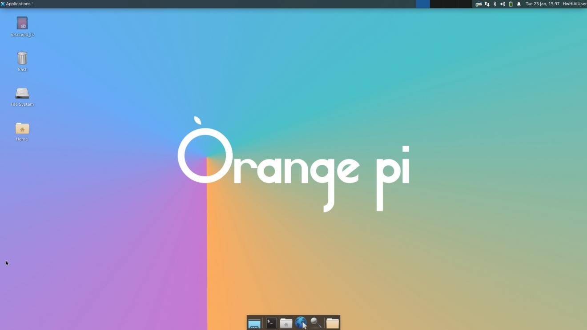

# 总结

通过本文档的操作，你已经掌握了与香橙派建立连接并进行操作的几种标准方法。以下是对这些方法的概述及其应用场景：
- 串口连接：这是一种基于物理串行通信的底层连接方式。其主要用途是在设备无网络连接的情况下进行初始系统配置，或在网络故障时进行诊断与排查。
- SSH 远程连接：SSH (安全外壳协议) 是进行远程系统管理的技术标准，也将是你在后续开发中最核心的工作方式。它通过加密信道提供安全的远程命令行访问，使您能通过网络对香橙派进行全面的控制，无需物理接触。
- VS Code 远程开发：该方法基于 SSH 协议，在 VS Code 集成开发环境中实现远程开发。它将本地强大的代码编辑、文件管理和调试功能无缝扩展至远程的香橙派，旨在显著提升代码编写和项目管理的效率。

本文档介绍的连接流程是后续所有开发任务的前置步骤。

这些操作步骤需要通过实践来熟悉。随着操作次数的增加，您将熟练掌握整个流程。（如果前面配置网络自动连接，再下次使用香橙派时，你的香橙派将直接连接到校园网，可以进一步简化并加速整个流程）