# Lecture 3 读取摄像头数据流，超声波测距

## 摄像头——颜色识别
我们会用 **thuei-1/sdk-python/Functions/ColorDetect.py**作为一个示例
### 一、预先准备

#### 1.软件
使用vscode ssh连接上板子 / 用MobaXterm连接上板子 / 用HDMI连接上屏幕

以vscode为例
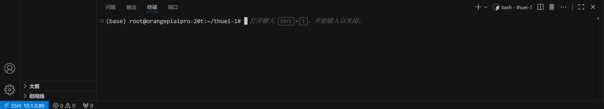

#### 2.硬件


**小车开电之前找志愿者检查！！！
小车开电之前找志愿者检查！！！
小车开电之前找志愿者检查！！！**

连错线容易烧板子，大家一定小心，不要问我怎么知道的（）

硬件常见的问题一般都是**接线没有接好，电源没有打开**等等，大家有些时候遇到问题可以先检查下硬件是否都连接到位了

用杜邦线连接对应的借口，**一定不要连错！！**
3，5，6依次对应

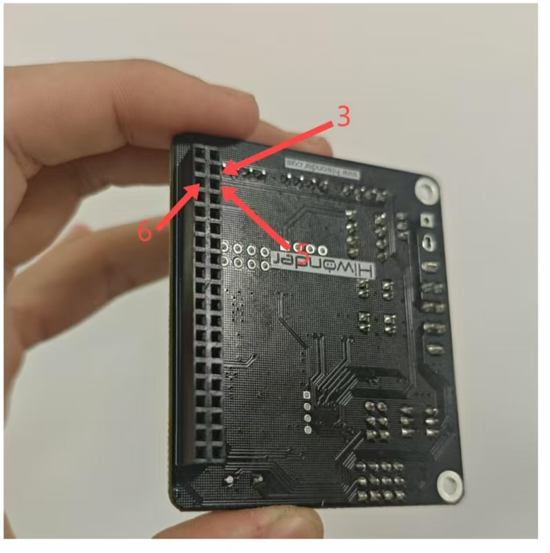
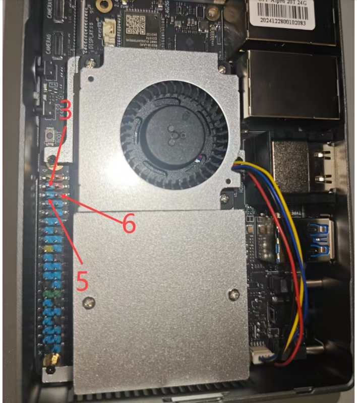

**摄像头的线**连接到**香橙派**上

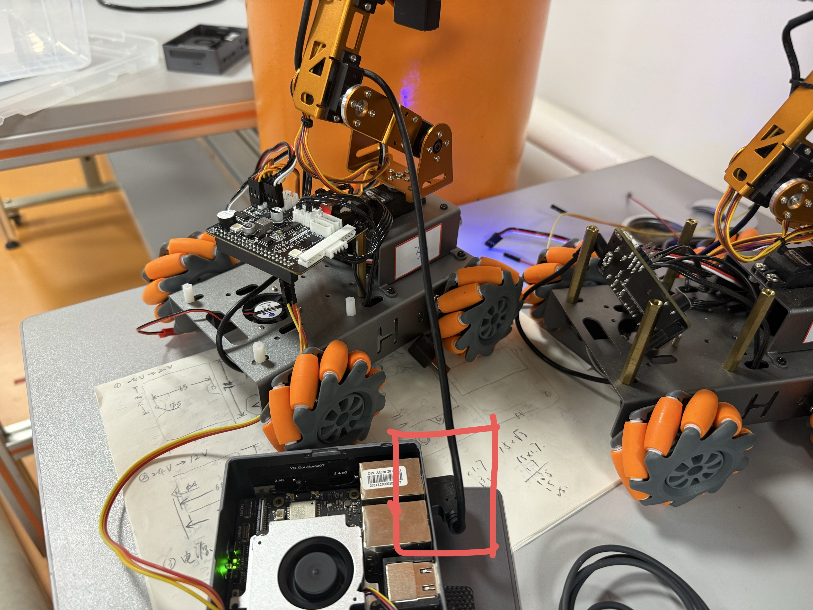


记得连接**板子的电源线**
记得打开**板子上的开关**，灯会亮


记得**打开电源**，在车子底下，打开后应该会有亮灯

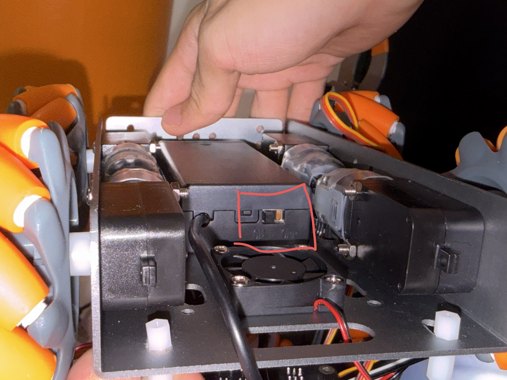


---


### 二、克隆代码仓库

#### 法一：从github上直接克隆下来

确保是在root所在的位置打开终端（命令行没有显示其他文件夹），在命令行输入下面这串代码

确保clone到的是**root文件夹底下**

```
git clone https://github.com/thuasta/thuei-1.git
```

#### 法二：直接将文件从本地导入
由于一些网络的问题很可能一直没办法clone下来，大家可以登上github的网站找到这个仓库直接下载到本地，或者下载已经下载好的

```
#拷贝到浏览器打开
https://github.com/thuasta/thuei-1
```

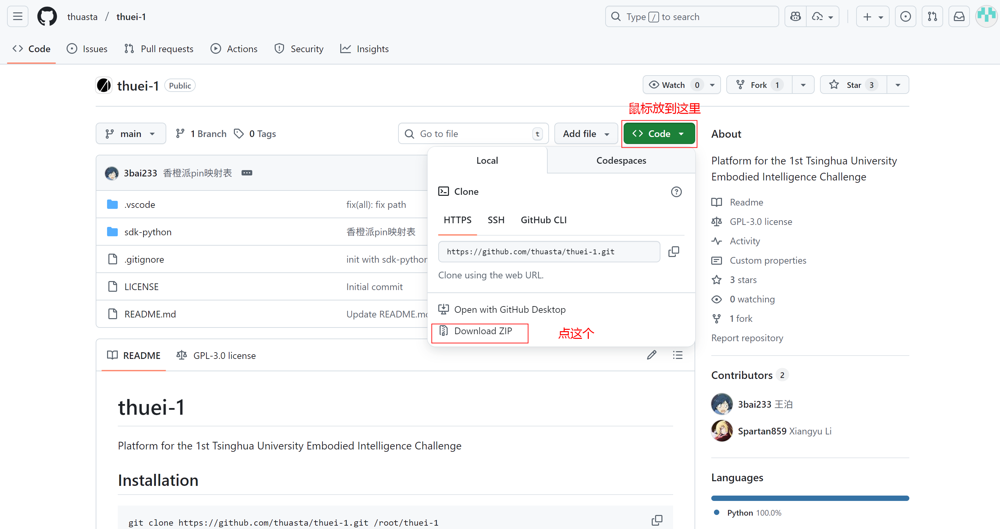

如果github实在登不上去，放到了云盘上
```
#拷贝到浏览器打开
https://cloud.tsinghua.edu.cn/d/cc73898d3e374b639648/
```

用vscode ssh连接上
把thuei-1这个文件夹直接拖到root文件夹底下，**注意一定是root**
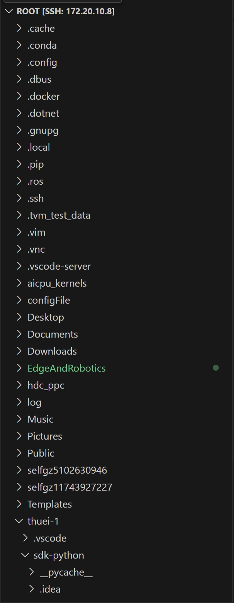

---

### 三、创建并激活新的conda环境

环境管理器：可以给同一台机器造出任意多个相互隔离的“软件栈”目录，每个目录里拥有自己独立的 Python 解释器版本和第三方库集合，切来切去互不影响。

执行完后你会得到一个**新环境 masterpi**，它和 base 当前状态 100% 一样，但以后在 masterpi 里装/卸/升级任何包都不会动到 base。

如果你在masterpi里进行了一些操作把这个环境搞坏了，直接删掉就好，就不会影响到base

#### 1.创建masterpi的conda环境

``` 
conda create -n masterpi --clone base 
```

#### 2.激活masterpi环境
我们这次都会在自己创建的masterpi这个环境里面进行活动，所以**确保命令行前面出现的是（masterpi）而不是（base）**

``` 
conda activate masterpi 
```

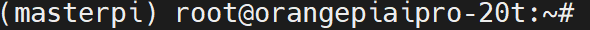

---

### 4.修改错误

ColorDetect.py中from ai_pro_pin_map import **_BOARD**原先大小写打错了
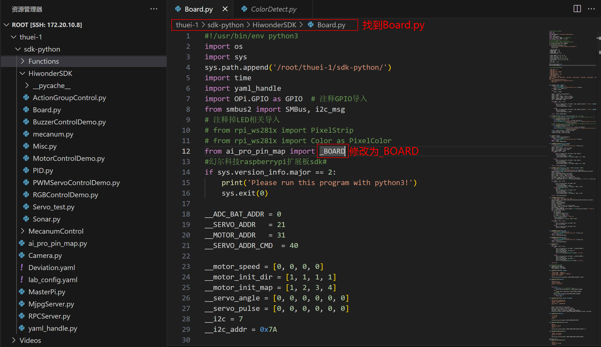


---


### 五、下载安装TightVNC

从这里开始，因为需要图形化界面来展示摄像头捕捉到的东西，建议用vnc
如果使用的是hdmi连接的桌面，则可以直接跳过

#### 1.下载 TightVNC

下载网站：https://www.tightvnc.com/

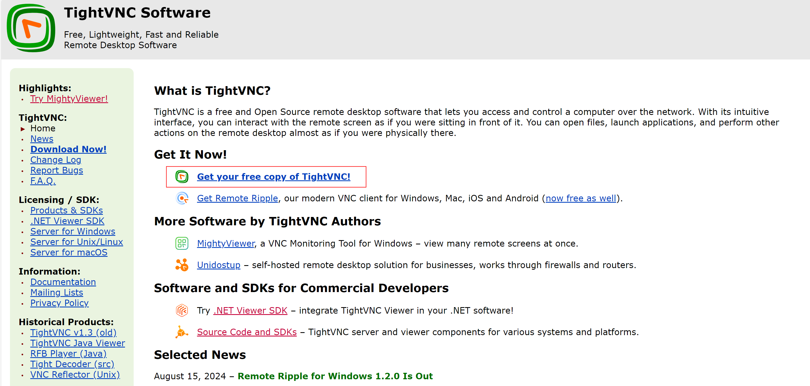
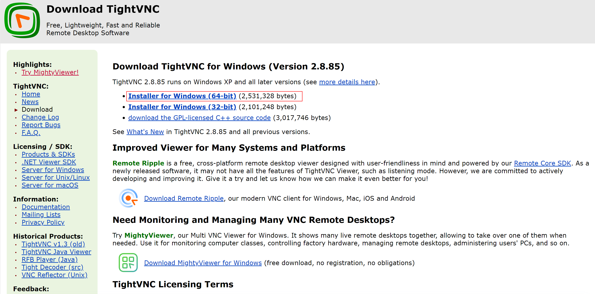


#### 2.安装 TightVNC

点击安装包安装


#### 3.TightVNC设置密码

在vscode命令行或者mobaxterm命令行输入以下命令
```
vncpasswd 123456
```

一般都把密码设置成123456，好记（）

如果让你再vertify一遍，再输入一次123456即可

如果问你问题，根据具体情况他会需要你输入(y/n)，根据情况输入y或者n即可


#### 4.启动VNC服务器

在vscode命令行或者mobaxterm命令行输入以下命令，代表启动vncserver并且设置成1080
```
vncserver :1 -geometry 1920x1080
```

如果后续步骤出现以下弹窗，也说明没有启动，再次输入
```
vncserver :1 -geometry 1920x1080
```

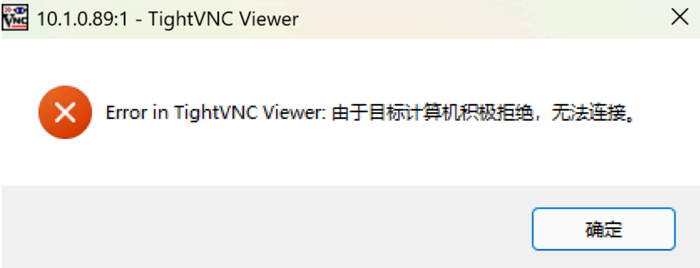


如果发现任何时候对桌面进行操作都没有反应，很可能是**卡死了**

在vscode命令行或者mobaxterm命令行输入以下命令，**关闭vncserver，再重新启动**
```
vncserver -kill :1
vncserver :1 -geometry 1920x1080
```


#### 5.启动VNC Viewer
找到tightVNC Viewer


Remote Host当中填写：XX.XX.XX.XX :1

XX.XX.XX.XX的ip地址就是之前的得到的香橙派的地址

**注意中英文的：:，要用的是英文的:**,

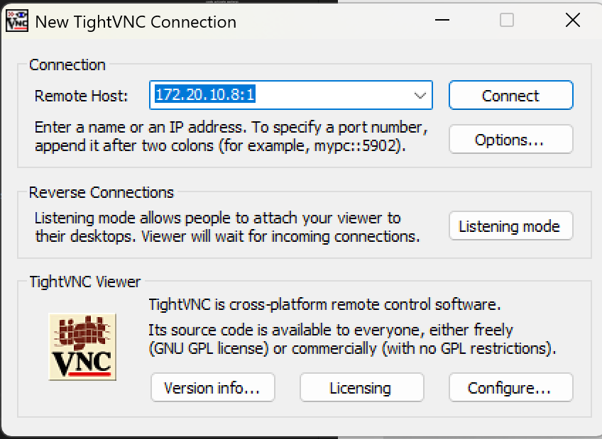

**点connect，输入密码**

得到以下画面即为成功，可以**进入需要的文件夹**

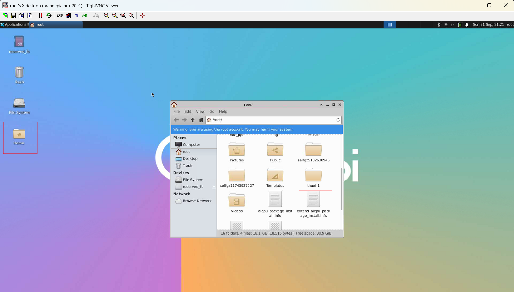
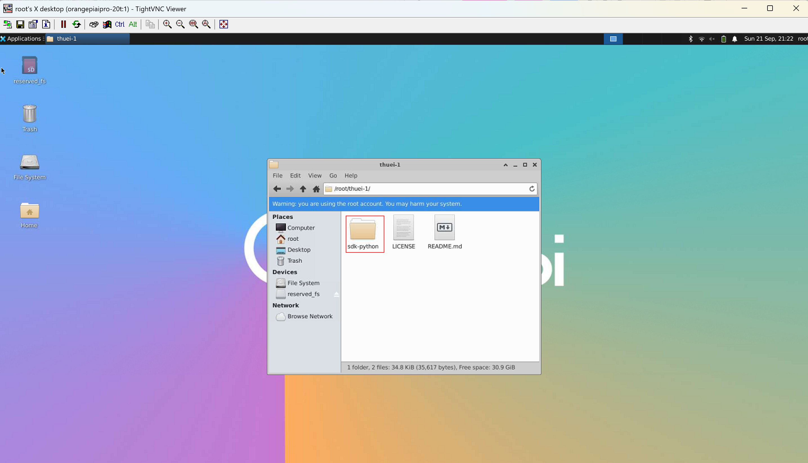
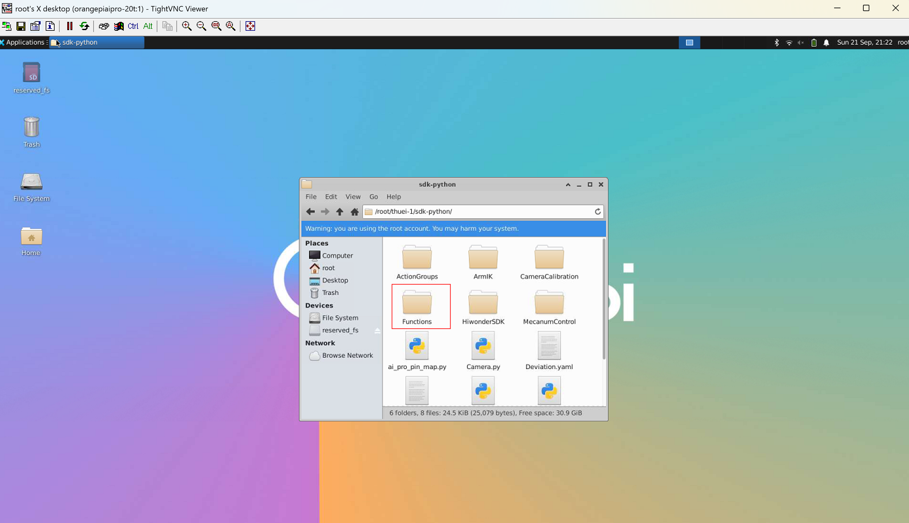
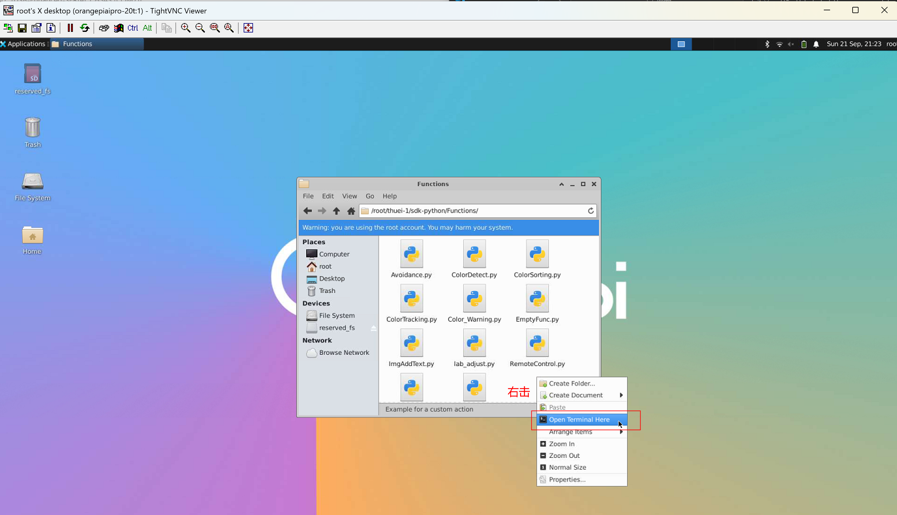


--- 

### 六、运行ColorDetect.py程序

这是一个 **“看到颜色就点头或摇头”** 的视觉机械臂小项目

运行python3 Functions/ColorDetect.py，在命令行输入以下命令
```
python3 ColorDetect.py
```

成功运行之后可以在摄像头面前展示红绿蓝不同颜色，机械臂会做出不同反应
<video controls src="./images/3beabc39baf72a2a0ae8210a19abdfa6.mp4" title="Title"></video>

#### 可能的问题：

1. **报错module 'HiwonderSDK.Board' has no attribute 'RGB'**

   把thuei-1/sdk-python/HiwonderSDK/Board.py文件中RGB相关的代码删掉，我们用不到


2. **报错信息当中有cap = cv2.VideoCapture('http://127.0.0.1:8080?action=stream')**
   
   括号里改成0
   cap = cv2.VideoCapture(0)

3. **AttributeError: module 'cv2' has no attribute 'VideoCapture'**
   在命令行输入以下命令
   ```
   pip install opencv-python==4.6.0.66 --trusted-host pypi.tuna.tsinghua.edu.cn --trusted-host files.pythonhosted.org --trusted-host pypi.org
   ```
4. **ImportError:**
   根据少了哪个库，install对应的库
   比如说没有numpy库，在命令行输入以下命令
   ```
   pip install numpy
   ```

5. **A module that was compiled using NumPy 1.x cannot be run in NumPy 2.0.2 as it may crash.**

   在命令行输入以下命令
   ```
   pip install matplotlib   
   pip install numpy
   ```
6. **命令行当中是（base）......**
   在命令行输入以下命令
   ```
   conda activate masterpi
   ```
7. **摄像头相关错误解决：**

   VIDEOIO(V4L2:/dev/video0): can't open camera表示无法打开摄像头
   因为没连USB

8. **遇到No module named OPi报错**
   在命令行输入以下命令
   ```
   pip install --upgrade OPi.GPIO
   ```
---

## 超声波

轮子会转，建议在小车底下放东西垫起来，不要碰倒其他物品

### 运行Avoidance.py程序
找到对应的程序的地址


运行python3 Functions/Avoidance.py，在命令行输入以下命令
```
 python3 Avoidance.py
```
成功运行之后可以在画面上看到打印出来的超声波距离，而且距离超声波进了轮子的运动会发生变化


#### 可能的问题：

1. **ImportError:**
根据少了哪个库，install对应的库
比如说没有numpy库，在命令行输入以下命令
```
pip install numpy
```

2. **（base）**
在命令行输入以下命令
```
conda activate masterpi
```


---

## 写在最后

大家过程中遇到一些问题可以先问讲师和志愿者，当然有一些问题可能我们也无法及时解答，只是比你们多了一点点经验，在某些共性问题上能够尽快解决。有一些个性的问题我们会努力帮大家解决，如果哪里讲的不好或者实在没能帮到忙希望大家见谅。

AI是个很好用的工具，无论是否申请到了copilot，其实都可以把报错信息或者一些疑问丢给ai让他帮你解答

两位部长之前一段话启发很大：
>很多同学在找ai提问时只复制粘贴报错信息，这样ai的回复可能不会很有针对性。建议大家同时给出设备信息和问题背景，尽量全面地提供你所知道的信息，比如ai让你查看某个命令的输出，可以把输出结果及时反馈给ai，并且主动提出自己对问题原因的猜测，引导ai的思考。（不过这个确实需要经验。遇到上面两个问题的话，可以试试把上面这段话直接喂给ai）

>还有要大概知道AI的知识储备有哪些，比如linux的基础操作，python的常用库，AI肯定知道得比较全面；但是像我们这个小车的具体功能，AI应该几乎是不知道，所以在问的时候尽量把示例代码等必要信息都提供给AI才可能获得比较满意的答案

>在调试过程中，要有意识地缩小问题范围。当你通过某条指令查看某个服务或配置项后，你需要判断这一项输出是否符合预期。如果现在没有经验无法判断，你可以将你的猜测以及命令返回值一起告诉AI，让AI帮助你判断某个服务是否有问题，但是自己一定要有意识地积累经验。如果某个方面已经确认没有问题，那么你就可以去尝试其他的猜测，不要无意识地ai让干嘛就一个一个试过去，很容易被带偏。

希望能够帮到大家的忙，祝大家比赛顺利！！

---


