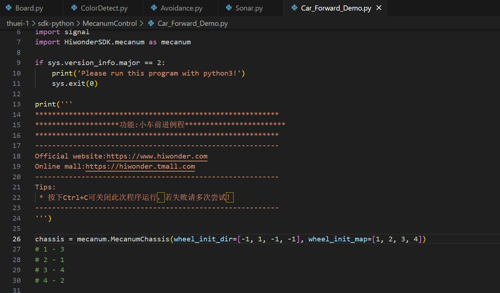
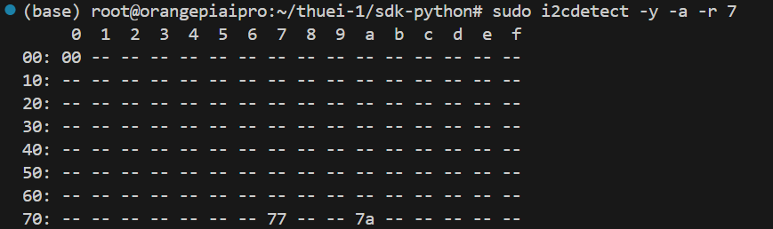
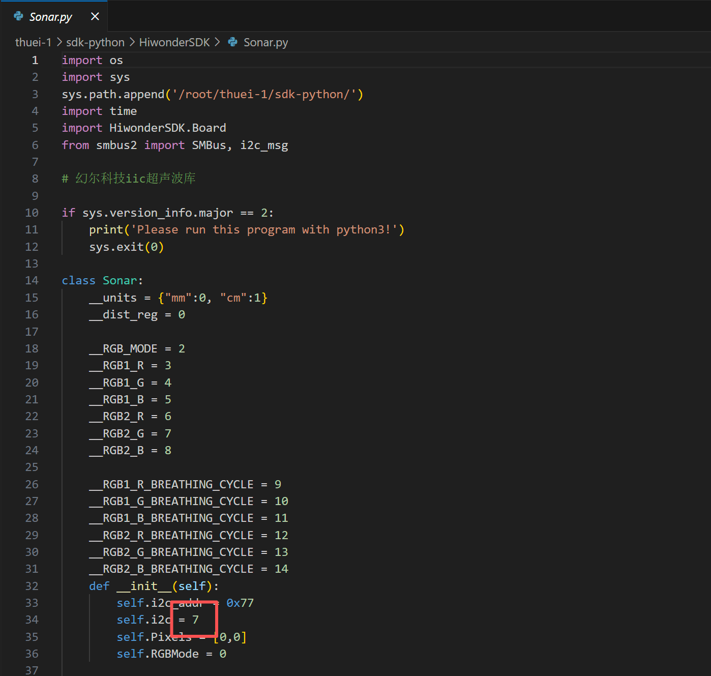

# 匹配轮子和麦轮运动控制

## 开始让车车跑起来吧！！！

### 这次的培训主要是让大家来实现thuei-1/MecanumControl/Car_Forward_Demo.py这个文件来确认轮子的编号

- 先把文件中第26行的
```
chassis = mecanum.MecanumChassis(wheel_init_dir=[1, 1, 1, 1], wheel_init_map=[2, 4, 1, 3])
```
改成
```
chassis = mecanum.MecanumChassis(wheel_init_dir=[1, 1, 1, 1], wheel_init_map=[1, 2, 3, 4])
```
- 马达转向配置
```
wheel_init_dir=[1,1,1,1]
```
1是正转（顺时针）-1是反转（逆时针）

- 轮子编号对应马达编号
```
wheel_init_map=[1, 2, 3, 4]
```
1-左前轮、2-右前轮、3-左后轮、4-右后轮



- 注意要确认轮子的接线顺序和方向是不是正确


## I2C
I2C(Inter-Integrated Circuit)序列通讯总线(一种串列通讯协定)

简单来说：只用两条线就能让多个IC芯片彼此通讯👇

那爲什麽我们要用i2c？

- 如果要接很多传感器或者马达驱动器，传统的方法每一个都要接很多线会很复杂
- 而i2c只需要2根线就好：串列资料线（SDA）和串列时钟线（SCL）
- 分爲主节点Master和从节点Slave
- Master(香橙派)负责去发问、传资料、决定时钟
- Slave(麦轮的马达驱动器)等着被叫地址，然后回答

简单的流程
- Master发出start的讯号，表示「我要讲话了」
- Master呼叫其中一个Slave的地址
- 被呼叫到的Slave回应
- 开始传送资料
- 传送完毕，Master发出Stop的讯号，通讯结束

想多了解i2c的原理可以参考:https://zh.wikipedia.org/wiki/I%C2%B2C

## 如果运行上面的Car_Forward_Demo.py出现问题的话 请查看I2C

### 如何查看I2C编号
```
i2cdetect -l
```
然后就会列出系统里面所有的I2C bus

### 如何查看I2C地址
```
sudo i2cdetect -y -a -r 7
```
命令扫描I2C总线上的所有设备的地址
- -y表示不提示确认
- -a表示显示所有地址（包括保留地址）
- -r表示使用快速模式
- 树莓派默认编号1 香橙派默认编号7



### 请记得修改thuei-1/HiwonderSDK/Sonar.py里面的第34行
```
self.i2c=7
```


## with 写法（语法糖）
```
try...finally的用法：
f = open("data.txt", "r")
try:
    content = f.read()
finally:
    f.close()  
```
确保不管发生什么，最后一定关闭

## 使用signal模块捕获SIGINT信号（MotorControlDemo.py）
- SIGINT(Signal Interrupt)
在Linux或Unix系统中，按下Ctrl+C的时候，系统会给正在运行的程序发送一个SIGINT，预设行爲是立刻退出
- 如果直接Ctrl+C终端程序的话，马达可能会卡在保持输出的状态，也就是说车子可能会乱跑
- 所以要拦截SIGINT，在程序退出前释放资源（停止马达转动、关闭GPIO等等）
- MotorControlDemo.py中的这一部分
```
start = True

def Stop(signum, frame):
    global start
    start = False
    print('关闭中...')
    MotorStop()  # 停止所有电机

signal.signal(signal.SIGINT, Stop)
```
就是用signal.signal捕获SIGINT来关闭所有马达（电机）【安全地退出】
- MotorControlDemo.py用来测试马达可不可以正常运转、速度控制有没有反应


## 常见问题
- 如果遇到 [Errno 5] Input/output error 请检查I2C连接和电池电量
- 如果轮子转的方向不对 请修改wheel_init_dir
- 如果小车不按照计划的方向走 请检查马达编号wheel_init_map


## 使用SMBus类创建I2C总线对象，__i2c参数指定总线编号
```python
from smbus import SMBus
    with SMBus(__i2c) as bus
```
I2C编号=Linux里面注册的I2C控制器的顺序

